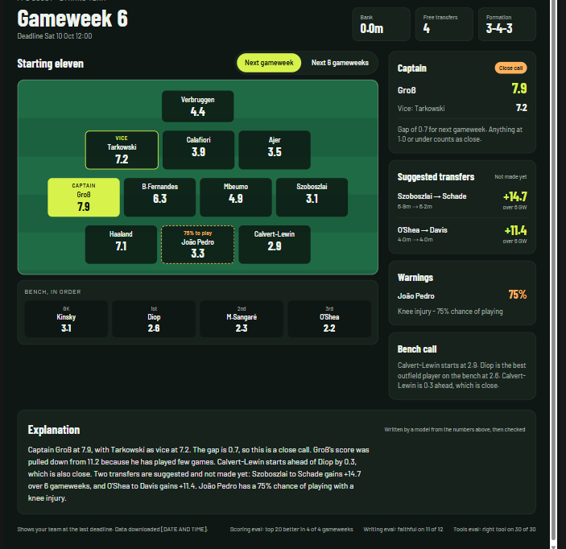

# FPL scout

A weekly brief for my Fantasy Premier League (FPL) team. It reads the free official
FPL data feed, picks a captain and a starting eleven, suggests up to two transfers and
warns about injured players. A model then explains the brief in plain English, and a
local web page shows it all.

I did not type the code. Claude Code agents wrote it. My part was deciding what to
build, answering the agents' questions, designing the workflow they follow, and checking
the results. This README shows that workflow, with links to the real files.



## What it does

The project was built in five stages. Each stage has a decisions file and a build plan in
[docs/prd/](docs/prd/).

| Stage | What it adds | Decisions |
|---|---|---|
| 1. Brief | `python -m fpl` prints captain, eleven, transfers and warnings from the feed. No AI. | [stage-1](docs/prd/stage-1-decisions.md) |
| 2. Scoring eval | Replays finished gameweeks to measure how good the advice was. | [stage-2](docs/prd/stage-2-decisions.md) |
| 3. Explanation | Claude writes a short explanation of the brief; code checks every number and name in it. | [stage-3](docs/prd/stage-3-decisions.md) |
| 4. MCP server | Ask Claude Code about the team; it answers by calling five read-only tools. | [stage-4](docs/prd/stage-4-decisions.md) |
| 5. React page | The brief as a page on this PC. The page does no maths; Python writes every number. | [stage-5](docs/prd/stage-5-decisions.md) |

A *gameweek* is one round of Premier League matches. Each one has a deadline for changing
your team.

## How to run it

You need Python 3.13, Node.js and npm, and Claude Code (for the explanation and the evals).

```
pip install requests pytest mcp==2.3.0
cd web
npm install          # once; downloads the page's libraries
```

Then, from the repo root:

```
brief                          # Windows: python -m fpl, then opens the page at localhost:5173
python -m fpl                  # download the feed and print the brief
python -m fpl --from tests/data/snapshot --no-explain   # a saved download, no network
python -m pytest               # Python tests (never touch the feed, never run claude)
cd web && npm test             # page tests: type check, then Vitest
```

The three evals (the last two use your Claude plan limits):

```
python -m fpl.eval             # scoring: replay finished gameweeks
python -m fpl.eval.writing     # writing: 4 briefs x 3 runs, checked by code and a judge
python -m fpl.eval.tools       # tool paths: 10 questions x 3 runs (--quick: 1 run each)
```

**The MCP server in Claude Code.** MCP (Model Context Protocol) is a standard way for a
program to offer tools that Claude can call. The server is registered in
[.mcp.json](.mcp.json). Start `claude` from the repo root, accept the `fpl` server, and
ask, for example, "who should I captain this week?". The tools are `get_brief`,
`get_players`, `find_replacements`, `get_eval_results` and `refresh`. None of them can make
a transfer, log in, or call Claude.

**Transfers made this week.** The public feed hides them until the deadline. Put them in
`this-week.json` in the repo root:

```json
{"gameweek": 6, "transfers": [{"out": "Player A", "in": "Player B"}], "bank": 0.8}
```

## How it was built with Claude Code

### The workflow: /questions, /plan-stage, /run-plan

Every stage went through three project skills (a *skill* is a saved instruction set you
start with a slash command):

1. [/questions](.claude/skills/questions/SKILL.md) interviews me one question at a time
   and writes each answer down as a numbered decision.
   > Ask ONE question at a time. Wait for the answer.
   > Give your recommended answer with every question, and one sentence on why.
   > If an answer is vague, do not accept it. Ask for a number, an example, or a yes or no.
2. [/plan-stage](.claude/skills/plan-stage/SKILL.md) turns the decisions into a build
   plan, and stops for my approval. Every decision must appear in a step.
3. [/run-plan](.claude/skills/run-plan/SKILL.md) builds the plan with builder agents,
   wave by wave.

The five decisions files hold **339 decisions, D1 to D339**. Each one gives its reason, and
later decisions say which earlier one they replace:

> D61: Base = 0.3 x form + 0.7 x points_per_game. Replaces D18. (reason: owner — one or
> two big games were dominating the advice)

### Vertical slices and waves

A *vertical slice* is a step that adds one thing you can run and see, end to end, instead
of one layer for later. From [/plan-stage](.claude/skills/plan-stage/SKILL.md):

> Step 1 also builds a skeleton where each later slice lives in its own file and is
> switched on by adding one line to a list.
> Group the steps into waves. Steps in the same wave touch none of the same files, apart
> from that one list.

So builders in the same wave can work at the same time without touching each other's files.
Stage 5's plan ([stage-5-plan.md](docs/prd/stage-5-plan.md)) has 12 steps in 3 waves; wave 2
holds 10 of them:

| Wave | Steps | Notes |
|------|-------|-------|
| 1 | 1 | skeleton, tooling, roadmap |
| 2 | 2, 3, 4, 5, 6, 7, 8, 9, 10, 11 | parts share only the spots above |
| 3 | 12 | brief.cmd and the owner's look; needs every part |

Across the five stages there are 40 steps.

### Parallel builder agents

The [builder agent](.claude/agents/builder.md) builds one step, runs the tests and commits.
It runs on Sonnet in its own *git worktree* (a separate working copy of the repo on its own
branch), so builders cannot overwrite each other:

```yaml
name: builder
tools: Read, Edit, Write, Grep, Glob, Bash
model: sonnet
isolation: worktree
```

It cannot ask me anything. If the documents do not say something, it must stop and report
it under BLOCKED instead of guessing. The main session then merges the branches one at a
time, in step order, and runs the tests after each merge. The `Merge branch
'worktree-agent-...'` commits in the git log are these merges.

At first `/run-plan` started a whole wave at once. It now starts **at most 3 builders at a
time**, because this PC has 8 GB of memory (commit `4a27e13`):

> Start one builder agent per step, at most 3 at a time (this PC has 8 GB of memory).

### The resolver agent

Builders flag open questions. Those go to the [resolver agent](.claude/agents/resolver.md),
not to me. It may answer only from the decisions file, or by quoting an official source
with a link. Anything that is my choice, it must escalate:

> 2. A FACT ABOUT THE OUTSIDE WORLD ... Your answer must quote the sentence that settles it
> and give the link. If you cannot find a source that states it plainly, do not answer:
> ESCALATE.
> 3. THE OWNER'S CHOICE ... Do not decide. ESCALATE, and give the options with your
> recommendation.

Each answer is written back into the decisions file. 18 decisions came from the resolver,
and 3 of those were escalated to me. Two real examples:

- **Answered with a quote** ([D187](docs/prd/stage-3-decisions.md)): "`claude auth status`
  exits 0 when logged in and 1 when not, as D172 assumes. (resolver; evidence: "Exits with
  code 0 if logged in, 1 if not.", https://code.claude.com/docs/en/cli-reference)"
- **Escalated to me** ([D253](docs/prd/stage-4-decisions.md)): the docs do not say which
  folder Claude Code starts a project MCP server in. The resolver found no source, so I
  decided: keep `python -m fpl.mcp`, tell the reader to start `claude` from the repo root,
  and prove it with a live test.

So the build only stopped for decisions that were really mine.

### Hooks

A *hook* is a command Claude Code runs at a set moment. Two hooks in
[.claude/settings.json](.claude/settings.json) run
[run_tests.py](.claude/hooks/run_tests.py), which blocks the agent from finishing while
tests fail (exit code 2):

- **Stop** (the main session): runs pytest if a `.py` file changed, and `npm test` if a
  file under `web/` changed.
- **SubagentStop** for builders: always runs both, because a builder has already committed,
  so git shows nothing as changed.

What went wrong:

- **The builder hook never ran.** In the first settings file, `SubagentStop` sat outside
  the `"hooks"` block, so Claude Code ignored it and gave no error. It was moved inside in
  commit `e38faa9`.
- **The tests got slower.** Stage 5 added the page tests to the hook, so the timeout went
  from 120 to 240 seconds (D326). The plan asked for both runs to be timed and the times
  written at the top of `run_tests.py`; that line still says `TIMES`.

### Permissions

From [.claude/settings.json](.claude/settings.json):

| | Commands | Why |
|---|---|---|
| Allowed | `python -m pytest`, `python -m fpl`, `git add`, `git commit`, `git merge`, `npm test`, `npm run`, `npm ci`, web search, fetching from premierleague.com | Builders run without me. `npm ci` installs exactly what `package-lock.json` lists; a new worktree has no `node_modules`, and a builder cannot answer a permission question (D327). |
| Asks first | `pip install`, `npm install`, `git push` | Downloading new code is my choice (D320). I push myself. |
| Denied | `Read(.env)` | Set in stage 3, when an API key was planned (D127). The plan changed to Claude Code's own login, so there is no `.env` today (D148). |

### Rules files and CLAUDE.md

[CLAUDE.md](CLAUDE.md) holds the rules every agent loads. Some boundaries:

> - Tests must never call the live feed.
> - Tests must never run claude.
> - Never edit or delete anything in data/raw/. Those downloads are the history that
>   later evals replay.

A *rules file* applies only to some paths. [.claude/rules/web.md](.claude/rules/web.md)
loads for `web/**`:

> - No calculations. The page never works out, rounds or compares a score, price or count.
> - Colours only from the CSS variables in web/src/theme.css.

The test suite has 386 Python tests (`python -m pytest --collect-only`), and every page
component has a test file next to it.

## Evals

An *eval* is a repeatable test of how good the output is, not just whether the code runs.
Every result is saved in [results/](results/) under the commit that made it.

### Scoring eval

It rebuilds each finished gameweek using only what was known before its deadline, then
compares the advice with the points players really scored. Gameweeks 2 to 5
([results/2026-10-06-0b4091c.txt](results/2026-10-06-0b4091c.txt)):

| | current formula | shrink formula | my own picks | best in hindsight |
|---|---|---|---|---|
| Captain points | 8 | 33 | 37 | 63 |
| Eleven points | 258 | 247 | 260 | 290 |
| Ranking (Spearman, mean) | 0.44 | 0.48 | | |

"Shrink" pulls a player with few games towards what is typical for his position and price.
It beat the current formula on ranking and on the top 20 in 4 of 4 gameweeks, so the brief
switched to it (D121). It did not beat my own picks (which had injury news the replay
lacks), and its top-20 total (20.20) is still
below simply picking the 20 most expensive players (20.95). The report says itself: "Few
gameweeks: small differences are likely noise."

### Writing eval

Runs the real writer on 4 briefs, 3 times each. Code checks every number and name; a
stronger model (the *judge*) lists any claim the brief does not support and scores clarity.

**The judge check.** Before scoring the writer, the judge is tested on 11 fixed texts: 9
with one planted fault each (a wrong captain, a made-up player, a transfer described as
made) and 2 clean ones. If it misses any, that run's scores are marked unproven.

How it went from the baseline to the final run:

| Run | What changed before it | Code checks | Faithful | Clarity |
|---|---|---|---|---|
| [fcf41b2](results/2026-10-06-fcf41b2-writing.txt) | baseline, Haiku writer | 92% | 33% | 3.7 |
| [d422820](results/2026-10-06-d422820-writing.txt) | clearer input labels (D199), stricter judge rubric (D196) | 92% | 50% | 3.9 |
| [37e06a5](results/2026-10-06-37e06a5-writing.txt) | verdict worked out by code (D201), Sonnet writer (D202) | 58% | 100% | 4.9 |
| [98ab847](results/2026-10-06-98ab847-writing.txt) | ask for about 120 words (D203) | 83% | 100% | 4.8 |
| [ceededa](results/2026-10-06-ceededa-writing.txt) | about 100 words, name each incoming player (D204-D206) | 100% | 92% | 4.8 |

What fixed what:

- **Input labels.** The baseline called suggested transfers "made" in 4 of 12 texts, got
  the bench gap backwards in 3, and called a 25% chance of playing a "25% injury risk" in
  2 (D199). The input now says "Suggested transfers (not made yet)", "who is ahead by how
  much", and "chance of playing: 25% (likely to miss)".
- **Verdict worked out by code.** On the d422820 run the judge's reason named a fault but
  its verdict said faithful. Now it only lists unsupported claims, and code sets faithful =
  the list is empty (D201).
- **A stronger model.** With Sonnet writing, 12 of 12 texts were faithful (D202), but 5
  were too long. Two prompt changes fixed the length.

The final run was 11 of 12 faithful. Its saved verdict says FAIL, because the bar then was
12 of 12. The one miss wrote "Wren has a 6 GW gain of +13.4", putting the transfer's gain
on the player. I then changed the bar to 11 of 12 (D207) and accepted the run as it is.

### Tool path eval

Asks Claude (Opus) ten questions against the MCP server, three times each. It checks the
*path* (did Claude call the right tool with the right player?) and that every number and
name in the answer appears in the tool outputs. The full run
([results/2026-10-07-c3347b1-tools.txt](results/2026-10-07-c3347b1-tools.txt)): path right
on **30 of 30**, answers passing the checks on **28 of 30**. The two misses quoted "top 5"
and a "−4 hit", numbers the tool knew but did not print. The tool now prints them (D267),
and the bar is now 27 of 30 (D268). No full run has been saved since that change.

## What I learnt

- **Check the feed against the real site.** The brief said 4 free transfers and a 0.0m
  bank; the FPL site said 2 and 0.8m. The public feed hides this week's transfers until the
  deadline, which led to `this-week.json` (D66).
- **A judge nobody has tested proves nothing.** So the judge gets planted faults on every
  run (D179). The writer's real mistakes in the baseline became three more planted faults
  (D196).
- **Fix the input before the prompt.** The baseline's mistakes were misreadings of the
  input, so the fix went into the input block, not the writer prompt (D199).
- **Let code decide what code can decide.** The judge's reason and verdict disagreed until
  code drew the verdict from the list of claims (D201).
- **Simple checks hit real text.** A case-blind name check banned "new", "will" and "rice",
  which are also player and club names in the feed, so nearly every explanation would have
  been skipped (D190).
- **Config can fail silently.** A hook in the wrong place in the settings file never ran
  and gave no error (commit `e38faa9`).

## Limits and what's next

- **Few gameweeks.** The scoring eval covers gameweeks 2 to 5 only. Past injury news is not
  in the feed, so the replay treats everyone as fit (D79, D88).
- **One PC.** The page and the MCP server run only on my Windows PC. No hosting, no login
  (D279, D220).
- **Hidden transfers.** The feed hides this week's transfers until the deadline, so I enter
  them by hand in `this-week.json` (D65).
- **Known gaps in the checks.** A number written as a word, or a real number attached to
  the wrong player, passes the code checks; the judge is the backstop (D145, D183).
- **The app never makes transfers itself.**

Next, from [docs/roadmap.md](docs/roadmap.md):

6. Chips, price changes, mini-league rivals and outside news.
7. A scheduled brief before each gameweek's deadline.
